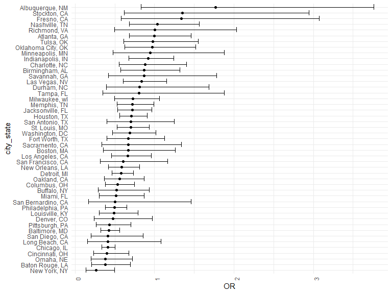
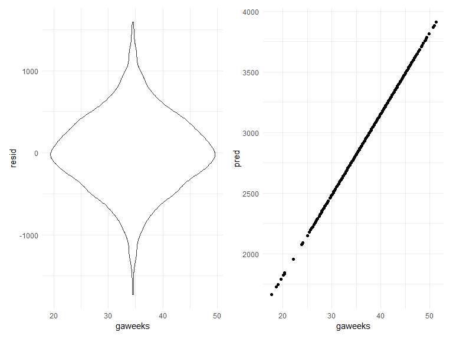
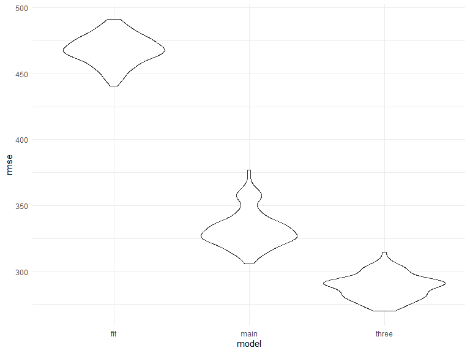
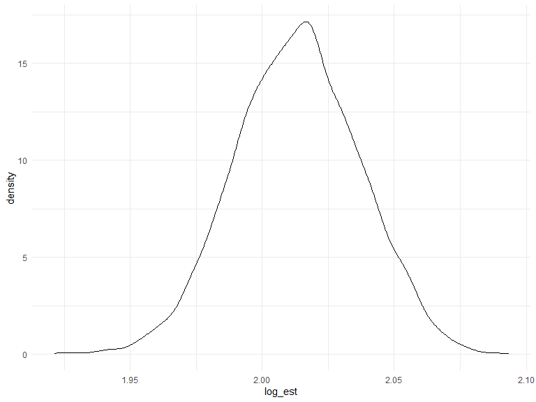

p8105\_hw6\_ys3394
================
Yifan Su
2020-11-28

### Problem 1

**Create a city\_state variable (e.g. “Baltimore, MD”), and a binary
variable indicating whether the homicide is solved, omit some cities,
and analyze `black` and `white` in the `victim_race` variable, besure
`victime_age` is numeric.**

``` r
homicide_df = 
  read_csv("data/homicide-data.csv", na = c("", "NA", "Unknown")) %>% 
  mutate(
    city_state = str_c(city, state, sep = ", "),
    victim_age = as.numeric(victim_age),
    resolution = case_when(
      disposition == "Closed without arrest" ~ 0,
      disposition == "Open/No arrest"        ~ 0,
      disposition == "Closed by arrest"      ~ 1)
  ) %>% 
  filter(
    victim_race %in% c("White", "Black"),
    city_state != "Tulsa, AL") %>% 
  select(city_state, resolution, victim_age, victim_race, victim_sex)
```

    ## Parsed with column specification:
    ## cols(
    ##   uid = col_character(),
    ##   reported_date = col_double(),
    ##   victim_last = col_character(),
    ##   victim_first = col_character(),
    ##   victim_race = col_character(),
    ##   victim_age = col_double(),
    ##   victim_sex = col_character(),
    ##   city = col_character(),
    ##   state = col_character(),
    ##   lat = col_double(),
    ##   lon = col_double(),
    ##   disposition = col_character()
    ## )

**For the city of Baltimore, MD, use the glm function to fit a logistic
regression with resolved vs unresolved as the outcome and victim age,
sex and race as predictors. **

``` r
baltimore_df =
  homicide_df %>% 
  filter(city_state == "Baltimore, MD")

glm(resolution ~ victim_age + victim_race + victim_sex, 
    data = baltimore_df,
    family = binomial()) %>% 
  broom::tidy() %>% 
  mutate(
    OR = exp(estimate),
    CI_lower = exp(estimate - 1.96 * std.error),
    CI_upper = exp(estimate + 1.96 * std.error)
  ) %>% 
  select(term, OR, starts_with("CI")) %>% 
  knitr::kable(digits = 3)
```

| term              |    OR | CI\_lower | CI\_upper |
| :---------------- | ----: | --------: | --------: |
| (Intercept)       | 1.363 |     0.975 |     1.907 |
| victim\_age       | 0.993 |     0.987 |     1.000 |
| victim\_raceWhite | 2.320 |     1.648 |     3.268 |
| victim\_sexMale   | 0.426 |     0.325 |     0.558 |

**Now run glm for each of the cities in your dataset, and extract the
adjusted odds ratio (and CI) for solving homicides comparing Black
victims to white victims.**

``` r
models_results_df = 
  homicide_df %>% 
  nest(data = -city_state) %>% 
  mutate(
    models = 
      map(.x = data, ~glm(resolution ~ victim_age + victim_race + victim_sex, data = .x, family = binomial())),
    results = map(models, broom::tidy)
  ) %>% 
  select(city_state, results) %>% 
  unnest(results) %>% 
  mutate(
    OR = exp(estimate),
    CI_lower = exp(estimate - 1.96 * std.error),
    CI_upper = exp(estimate + 1.96 * std.error)
  ) %>% 
  select(city_state, term, OR, starts_with("CI")) 
```

**Create a plot that shows the estimated ORs and CIs for each city.
Organize cities according to estimated OR, and comment on the plot.**

``` r
models_results_df %>% 
  filter(term == "victim_sexMale") %>% 
  mutate(city_state = fct_reorder(city_state, OR)) %>% 
  ggplot(aes(y = city_state, x = OR)) + 
  geom_point() + 
  geom_errorbar(aes(xmin = CI_lower, xmax = CI_upper)) + 
  theme(axis.text.x = element_text(angle = 90, hjust = 1))
```



## Problem 2

Find some residuals

``` r
baby_df = 
  read_csv("./data/birthweight.csv") %>% 
  janitor::clean_names() %>% 
  dplyr::select(babysex, bhead, blength, bwt, gaweeks) %>% 
  drop_na() %>% 
  relocate(bwt, everything()) %>% 
  mutate(
    babysex = case_when(
      babysex == "1" ~ "male",
      babysex == "2" ~ "female") %>% 
      as.factor()
  )
```

fit a model

``` r
model_fit = lm(bwt ~ gaweeks, data = baby_df)
```

``` r
resid_plot =
baby_df %>% 
  modelr::add_residuals(model_fit) %>% 
  ggplot(aes(x = gaweeks, y = resid)) + 
  geom_violin()

pred_plot =
baby_df %>% 
  modelr::add_predictions(model_fit) %>% 
  ggplot(aes(x = gaweeks, y = pred)) + 
  geom_point()

resid_plot + pred_plot
```



``` r
model_main = lm(bwt ~ blength + gaweeks, data = baby_df)
model_three = lm(bwt ~ bhead*blength*babysex, data = baby_df)
```

``` r
cv_df =
  crossv_mc(baby_df, 100) %>% 
  mutate(
    train = map(train, as_tibble),
    test = map(test, as_tibble))

cv_df = 
  cv_df %>% 
  mutate(
    model_fit   = map(.x = train, ~lm(bwt ~ gaweeks, data = .x)),
    model_main  = map(.x = train, ~lm(bwt ~ blength + gaweeks, data = .x)),
    model_three = map(.x = train, ~lm(bwt ~ bhead*blength*babysex, data = as_tibble(.x)))) %>% 
  mutate(
    rmse_fit = map2_dbl(.x = model_fit, .y = test, ~rmse(model = .x, data = .y)),
    rmse_main    = map2_dbl(.x = model_main, .y = test, ~rmse(model = .x, data = .y)),
    rmse_three = map2_dbl(.x = model_three, .y = test, ~rmse(model = .x, data = .y)))
```

``` r
cv_df %>% 
  dplyr::select(starts_with("rmse")) %>% 
  pivot_longer(
    everything(),
    names_to = "model", 
    values_to = "rmse",
    names_prefix = "rmse_") %>% 
  mutate(model = fct_inorder(model)) %>% 
  ggplot(aes(x = model, y = rmse)) +
  geom_violin()
```



## Problem 3

``` r
weather_df = 
  rnoaa::meteo_pull_monitors(
    c("USW00094728"),
    var = c("PRCP", "TMIN", "TMAX"), 
    date_min = "2017-01-01",
    date_max = "2017-12-31") %>%
  mutate(
    name = recode(id, USW00094728 = "CentralPark_NY"),
    tmin = tmin / 10,
    tmax = tmax / 10) %>%
  select(name, id, everything())
```

    ## Registered S3 method overwritten by 'hoardr':
    ##   method           from
    ##   print.cache_info httr

    ## using cached file: C:\Users\suyif\AppData\Local\cache/R/noaa_ghcnd/USW00094728.dly

    ## date created (size, mb): 2020-10-02 15:46:57 (7.535)

    ## file min/max dates: 1869-01-01 / 2020-09-30

``` r
weather_stp =
  weather_df %>% 
  modelr::bootstrap(5000, id = "strap_number") %>% 
  mutate(
    models = map(.x = strap, ~lm(tmax ~ tmin, data = .x)),
    r_square = map2_dbl(.x = models, .y = strap, ~ modelr::rsquare(.x, .y)),
    results = map(models, broom::tidy)
  ) %>% 
  dplyr::select(strap_number, r_square, results) %>% 
  unnest(results)

weather_stp %>% 
  filter(term == "tmin") %>% 
  ggplot(aes(x = estimate)) + 
  geom_density()
```


``` r
weather_stp %>% 
  filter(term == "tmin") %>% 
  ggplot(aes(x = r_square)) + 
  geom_density() +
  stat_quantile(quantiles = c(0.025, 0.0975))
```

    ## Error: stat_quantile requires the following missing aesthetics: y

``` r
weather_stp %>% 
  dplyr::select(strap_number, term, estimate) %>% 
  pivot_wider(
    names_from = "term",
    values_from = "estimate"
  ) %>% 
  janitor::clean_names() %>% 
  mutate(
    log_est = log(intercept*tmin)) %>% 
  ggplot(aes(x = log_est)) +
  geom_density()
```


